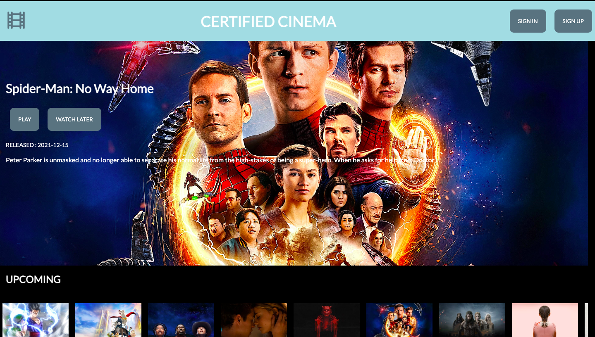
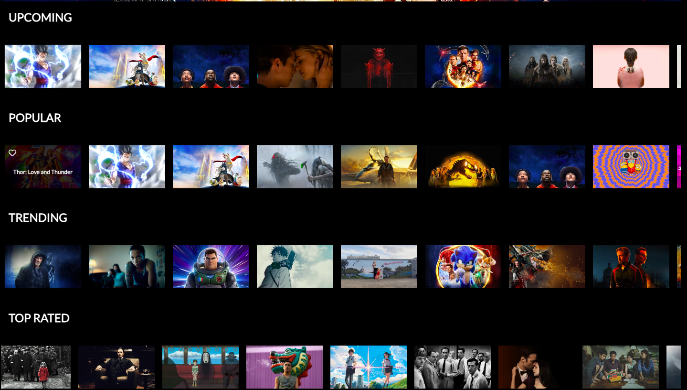
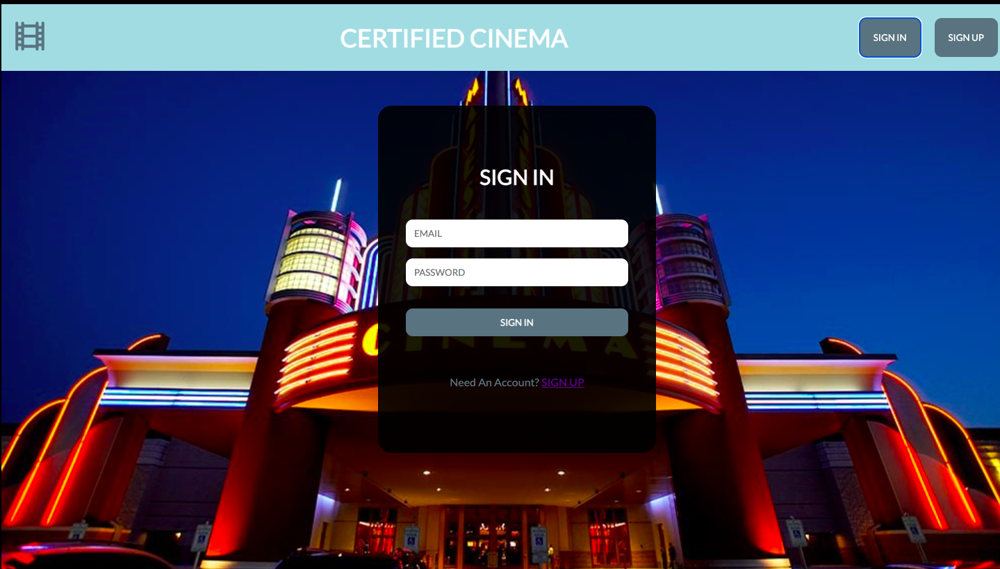
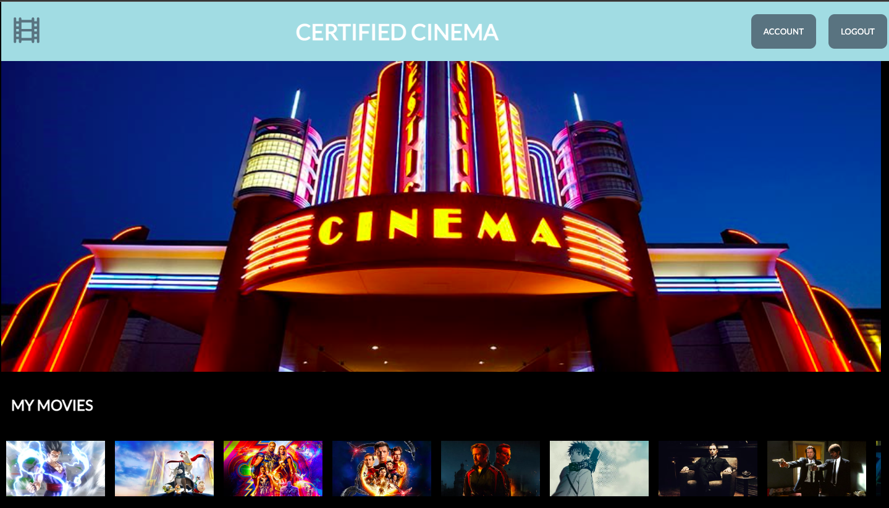

*"CERTIFIED CINEMA"*
===========
Learn more about the developer: 

LinkedIn: https://www.linkedin.com/in/nhathoangdev/

Portfolio: https://nhoang1122.github.io/

*"CERTIFIED CINEMA"* is a Full-Stack Movie Browsing Application. Users can Sign In or Sign Up with an Email and Password through FireBase. Certified Cinema is connected to the Movie Database API. Users can save Movies and it will sync up to their Account Page. 

#### Technologies
React, CSS, API, FireBase

#### Version 2.0

###### Profile Picture
In the future, I'd like to add an option for users to add a Profile Picture. 